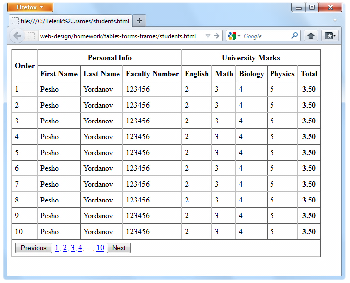
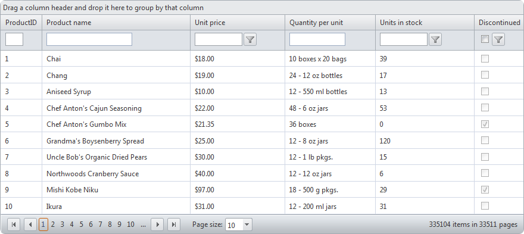

###### [My Telerik Academy Courses](https://github.com/nikolovdeyan/TelerikAcademy) 
-------------------------------------

HTML Forms and Frames
=====================

### [Problem 1. Registration form](./Problem_1.Registration_Form)
*	Create a Web form that looks like this sample:

### [Problem 2. University grid](./Problem_2.University_Grid)
*	Create the following using tables and forms:

### [Problem 3. Notebook store](./Problem_3.Notebook_Store)
*	Create the following HTML Page:

_Hint: Use Fieldsets and Nested tables_
	

		
### [Problem 4.* Grid component](./Problem_4.Grid_Component)
*	Construct the following Grid component:
	*	Try to make a HTML page, that looks just like the example
	*	CSS is required

