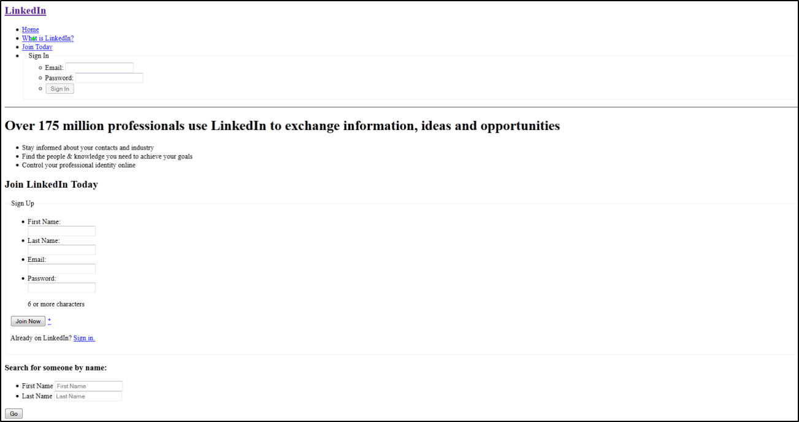

###### [My Telerik Academy Courses](https://github.com/nikolovdeyan/TelerikAcademy) 
-------------------------------------

Semantic HTML
=============

### [Problem 1. Refactoring](./Problem_1.Refactoring)
*	Refactor (edit) the `homework-refactoring.html` web page and make it HTML semantic.

### [Problem 2. Student System](./Problem_2.Student_System)
*	Create a web page using semantic HTML by the design.
*	Use some kind of approach to support old (non-HTML5-compatible) Web browsers like IE8.

_Note: Do not try to make the same styles. Implement just the content with its semantics._

### [Problem 3. LinkedIn](./Problem_3.LinkedIn)
*	Create a web page using semantic HTML by the design.

_Note: Do not try to make the same styles. Implement just the content with its semantics._
