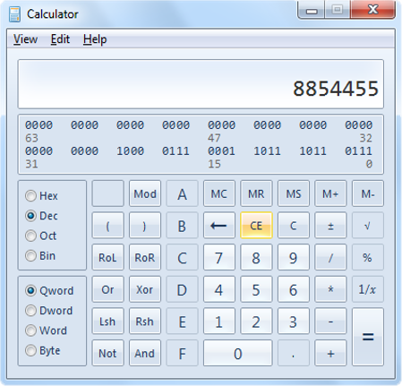

CSS Styling > 02.CSS Presentation > Problem 4. Windows Calculator
================

*	Create a web page that looks like the Windows calculator in `Programmer` view
	*	It should look exactly the same
	*	Implement hover effects for the buttons
	
_Note: The calculator should not have any functionality_

