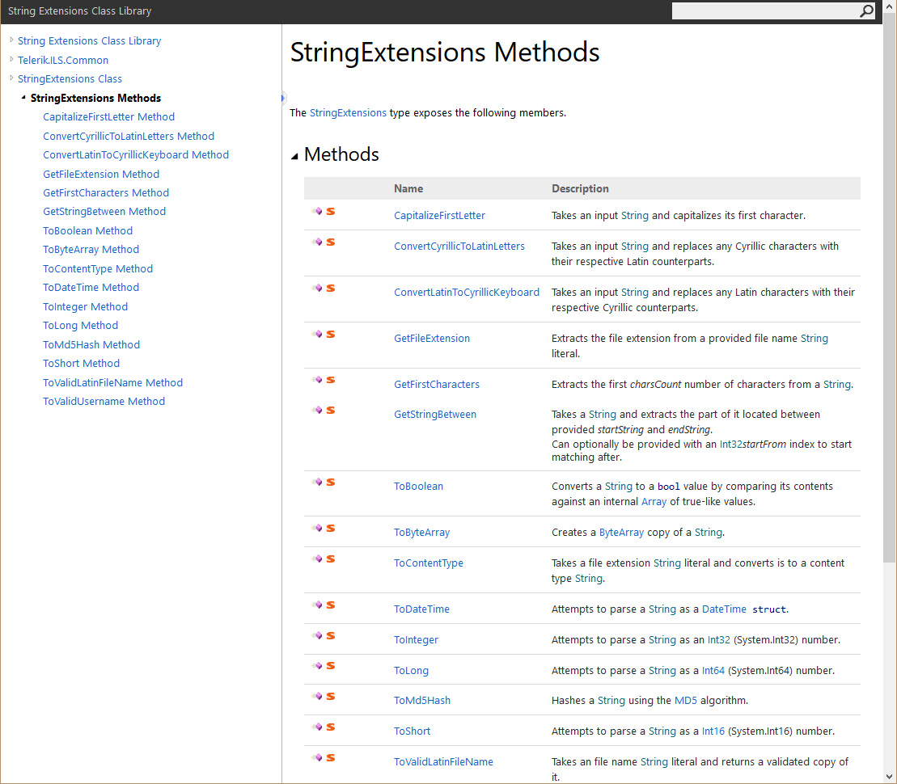
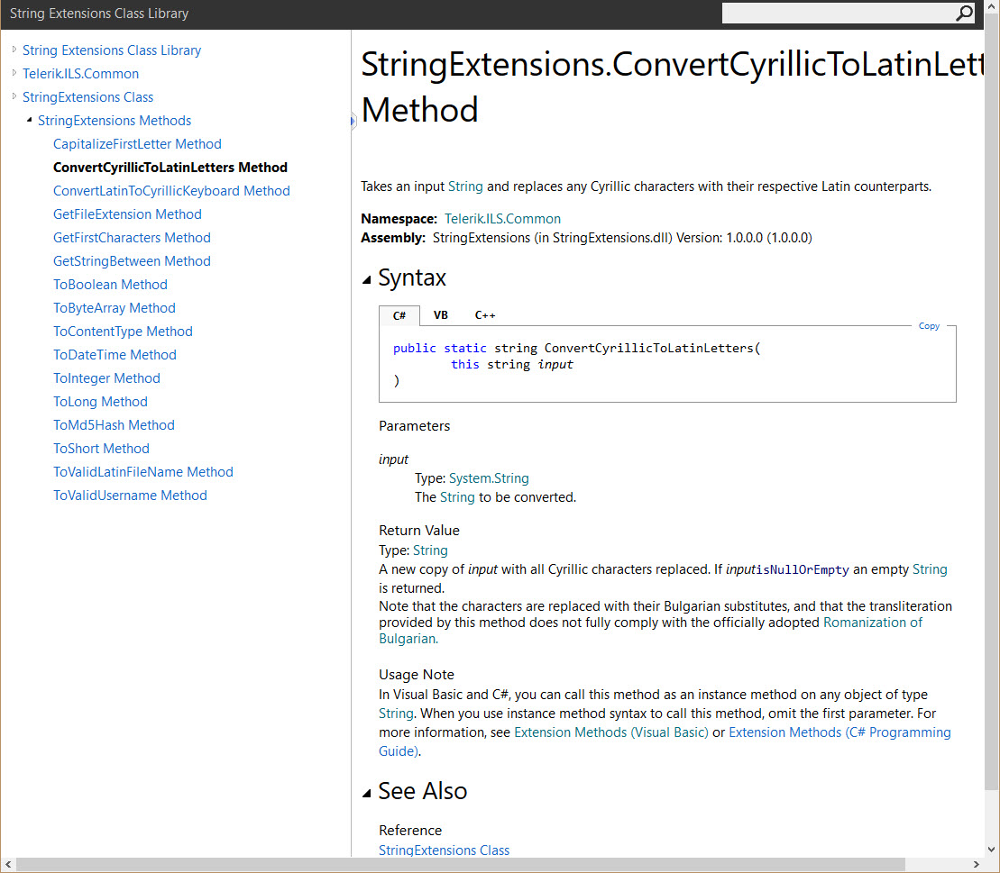
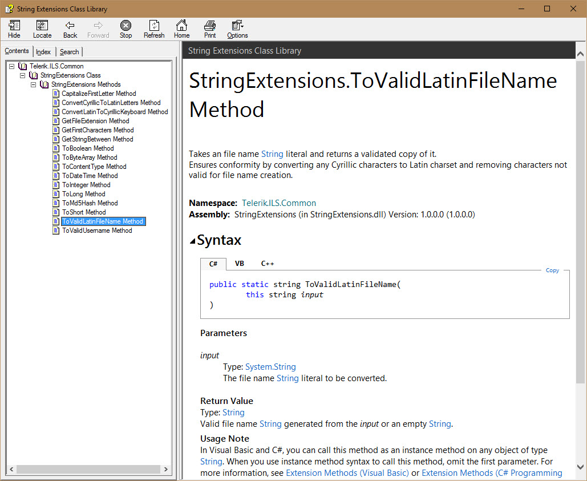
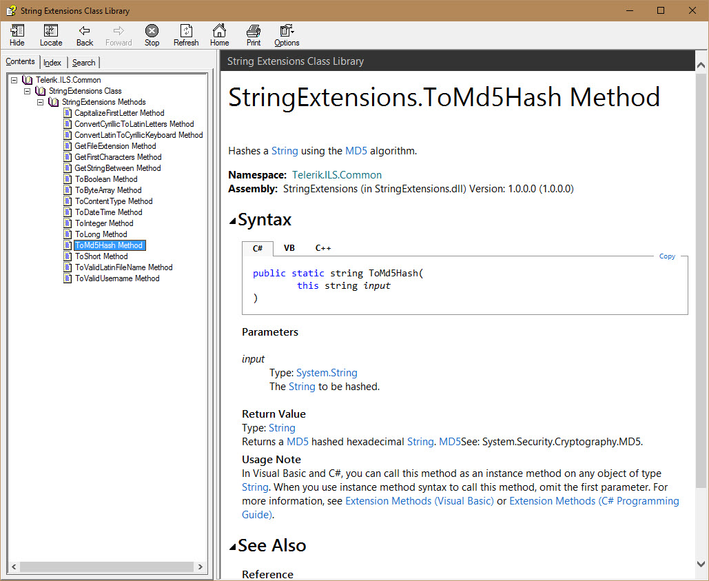

###### [Back to Development Tools Howework](../)
-------------------------------------

# SandCastle Usage Examples
SandCastle is a documentation generation tool that has been introduced to us in the High Quality Code I course and I spend some time to play with it then: 

Below are some examples of my usage of SandCastle:
## Examples:
1. Examples below are from the following homework [HQCI-Documentation and Comments](https://github.com/nikolovdeyan/TelerikAcademy/tree/master/09.High_Quality_Code_Part_I/HOMEWORK/HQC_03_HW-Code_Documentation_and_Comments/01.String%20Extensions/Documentation) ,where the full documentation is available.
2. Sample of HTML documentation generated with SandCastle:

3. Sample of HTML documentation generated with SandCaslte:
 
4. Sample of CHM documentation generated with SandCastle:

5. Sample of CHM documentation generated with SandCastle:

