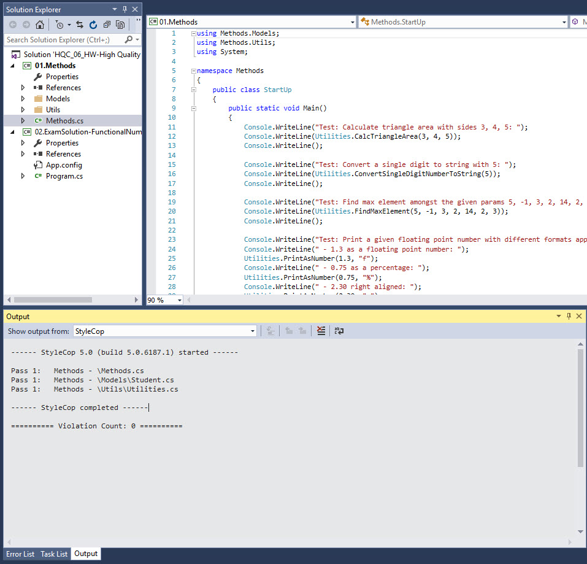
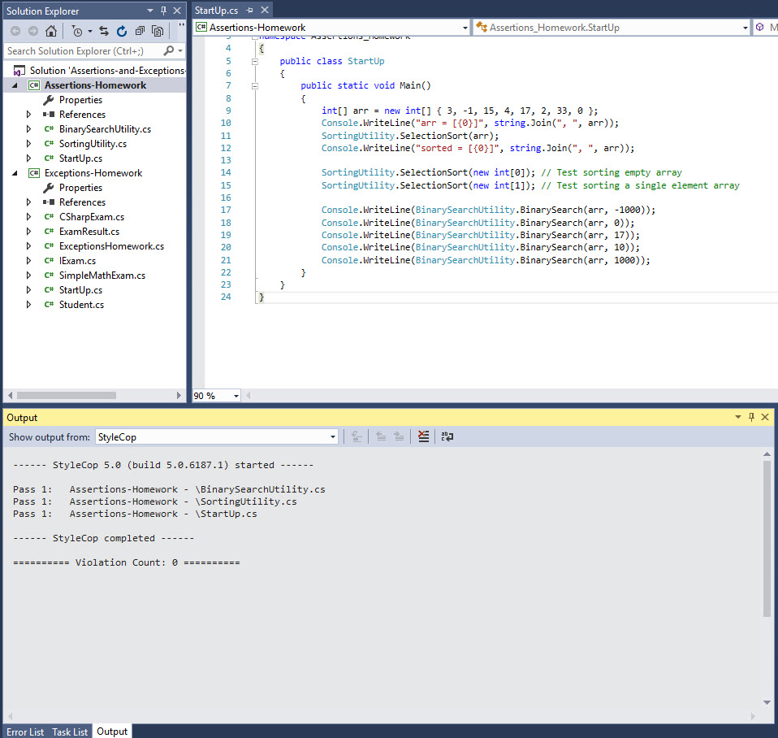

###### [Back to Development Tools Howework](../)
-------------------------------------

# StyleCop Usage Examples
I am using StyleCop for my C# projects since it was introduced to us in the High Quality Code I course. My homework sumbissions since then are checked and aligned with the StyleCop recommendations.

Below are some examples of my usage of StyleCop:
## Examples:
1. StyleCop usage in a homework solution in the HQCI course:

2. StyleCop usage in a homework solution in the HQCII course:
 
