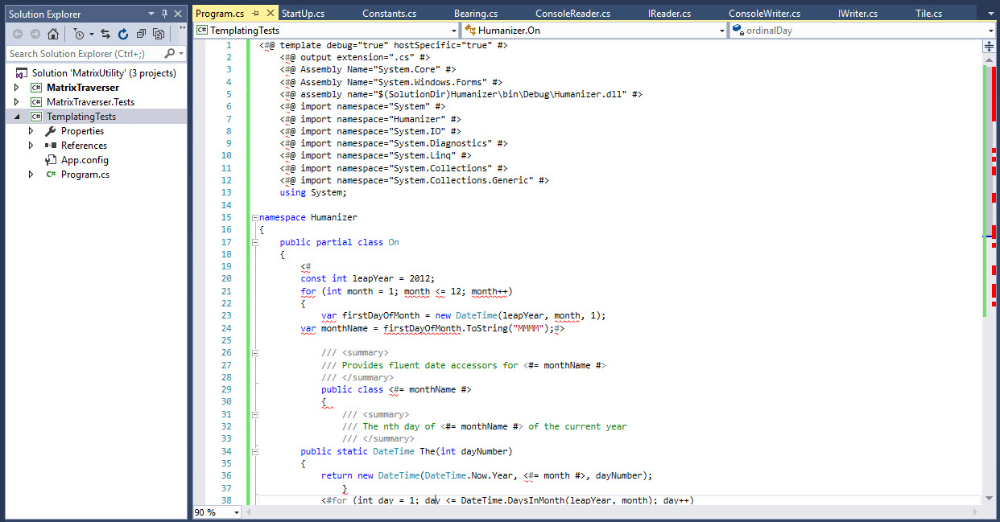

###### [Back to Development Tools Howework](../)
-------------------------------------

# T4Template Usage Examples:
T4Template is another new tool for me. To check it out i used [this tutorial](https://code.tutsplus.com/tutorials/code-generation-using-t4--cms-19854)

Below are some examples of my usage of T4Template:
## Examples:
1. T4Template
 
