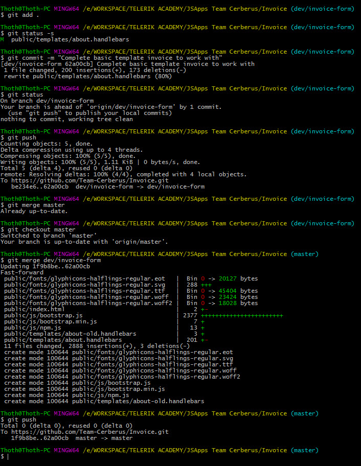
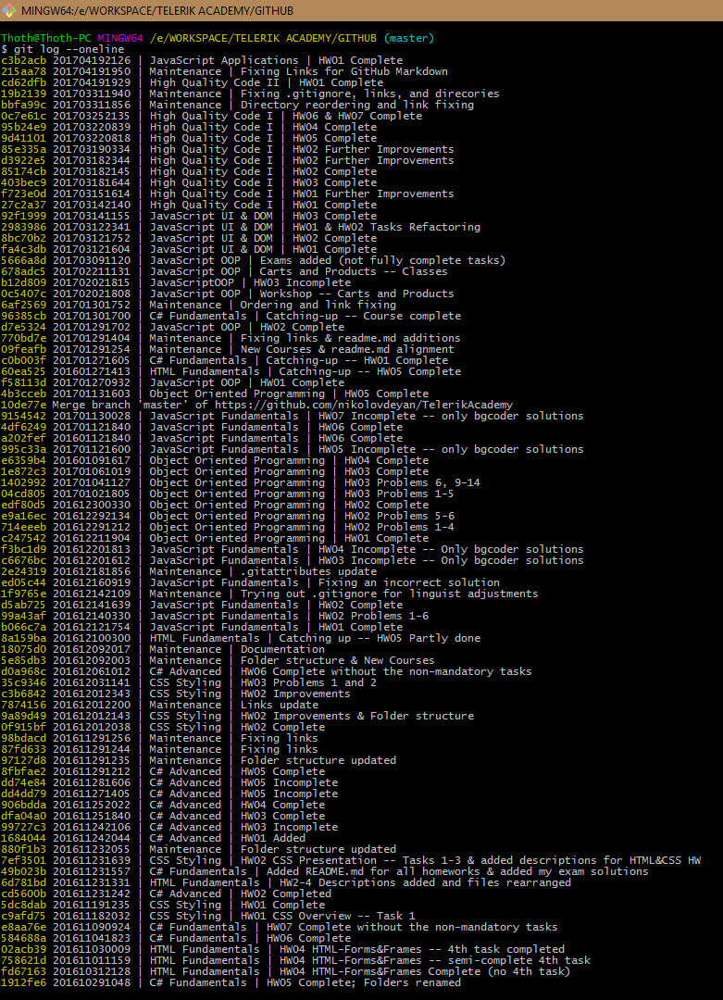

###### [Back to Development Tools Howework](../)
-------------------------------------

# Source Control System Usage Example - git
I use git for source control and backup for my code since I started studying in Telerik Academy. I choose git as it is by far the most widely used tool for the purpose, and I wanted to be able to use it freely when I am finished with my studies. 

Below are some examples of my usage of git:
## Examples:
1. [My GitHub commit history since starting in TelerikAcademy](https://github.com/nikolovdeyan/TelerikAcademy/commits/master)
2. Usage of git in my current project for the JavaScript Applications course -- branching. 
 
3. Usage of git -- gitlog for some of my commits for this repository

