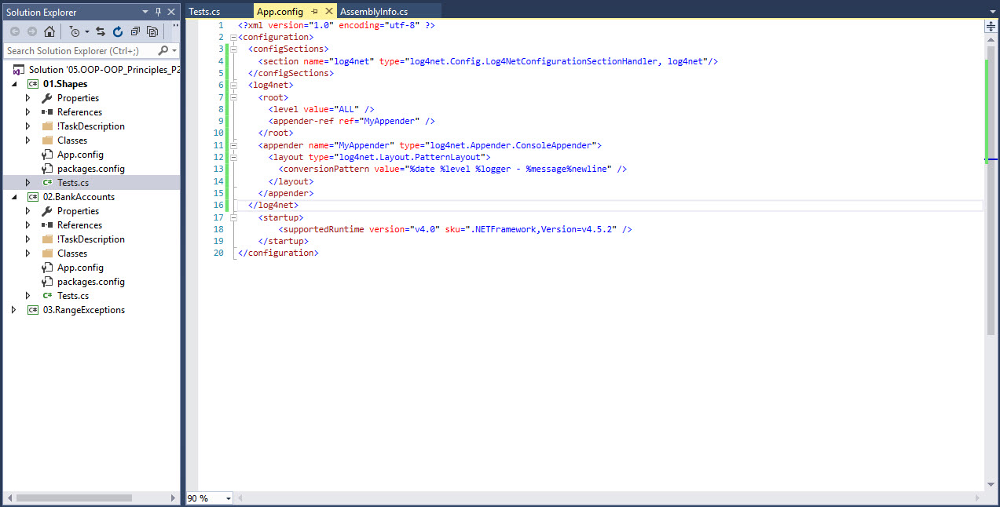
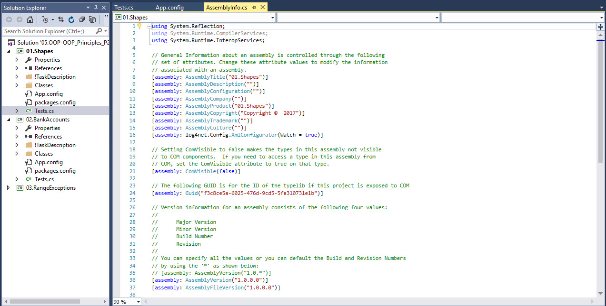
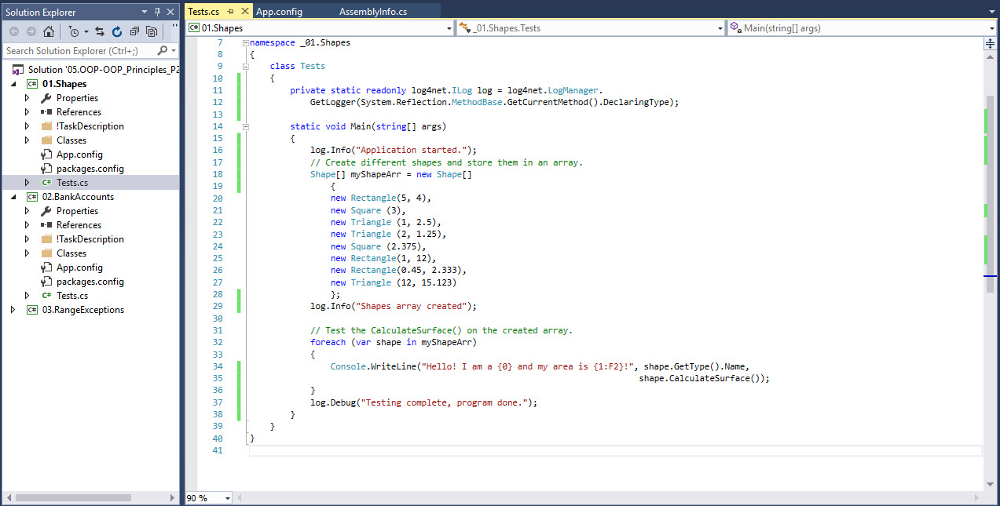
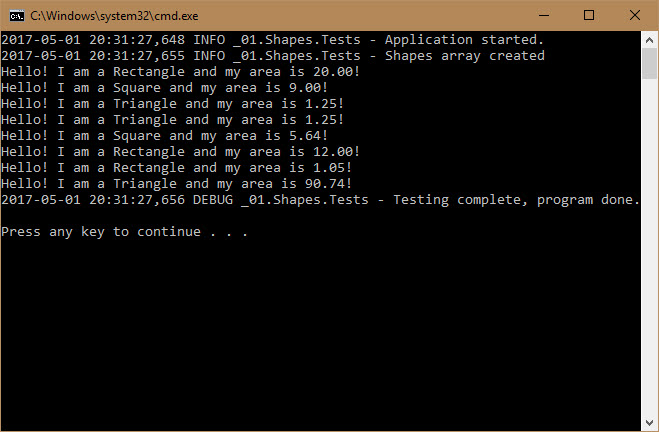

###### [Back to Development Tools Howework](../)
-------------------------------------

# log4net Logger Usage Examples:
I haven't used a logger in Visual Studio before but i found log4net to be very easy to setup and similar to the other loggers that I have used (the Python logging system).

Below are some examples of my usage of log4net:
## Examples:
1. Configuring log4net for one of the homeworks:

2. Configuring log4net:
 
3. Using log4net -- adding some debug messages to test:

4. Using log4net -- output in the console:

