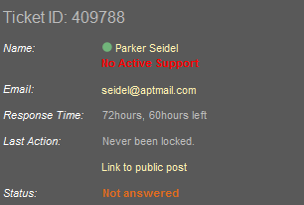

CSS Styling > 01.CSS Overview > Problem 1. Ticket CSS
============

*	Create the following page section using HTML and external CSS (no inline styles).
*	Use a table or a definition list (the layout will be different).

