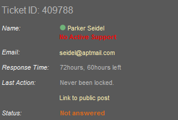

#### [Telerik Academy Courses](../../../) > [CSS Styling](../../) > [Homework](../) > 01.CSS Overview
-----------------------------------------------------------

CSS Overview
============

### [Problem 1. Ticket CSS](./Problem_1.Ticket_CSS)
*	Create the following page section using HTML and external CSS (no inline styles).
*	Use a table or a definition list (the layout will be different).

### [Problem 2. International Employees](./Problem_2.International_Employees)
*	Create the following Web page using external CSS styles.

### [Problem 3. Forum Posts](./Problem_3.Forum_Posts)
*	Create a web page using the design and the HTML markup in [homework.html]

