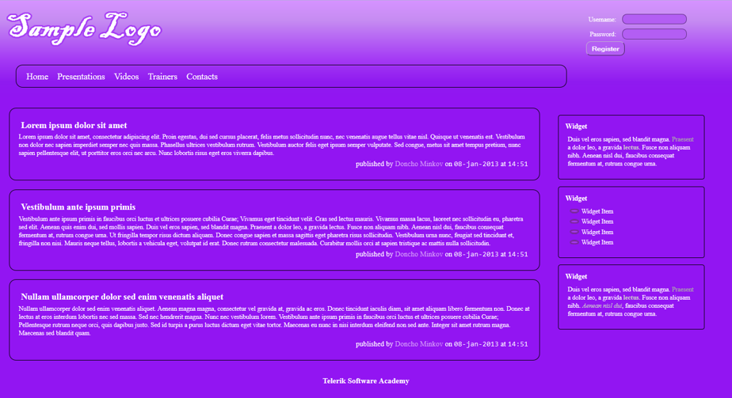

CSS Styling > 02.CSS Presentation > Problem 2. Forum Posts
================

*	You are given pre-written HTML and CSS code.
*	Expand this code to make the web page to look exactly like the PNG image:

