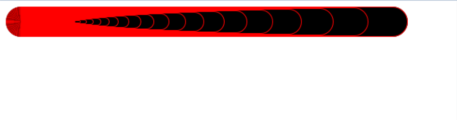

CSS Presentation
================

### [Problem 1. Lorem Ipsum page](./Problem_1.Lorem_Ipsum_Page)
*	Create the following web page
	*	Fonts used: `Consolas, Edwardian Script ITC`
	*	Color: `#0094ff`
	

### [Problem 2. Forum Posts](./Problem_2.Forum_Posts)
*	You are given pre-written HTML and CSS code.
*	Expand this code to make the web page to look exactly like the PNG image:

### [Problem 3. Nested Divs](./Problem_3.Nested_Divs)
*	Create the following web page
	*	Using `60` nested `div` elements

### [Problem 4. Windows Calculator](./Problem_4.Windows_Calculator)
*	Create a web page that looks like the Windows calculator in `Programmer` view
	*	It should look exactly the same
	*	Implement hover effects for the buttons
	
_Note: The calculator should not have any functionality_

