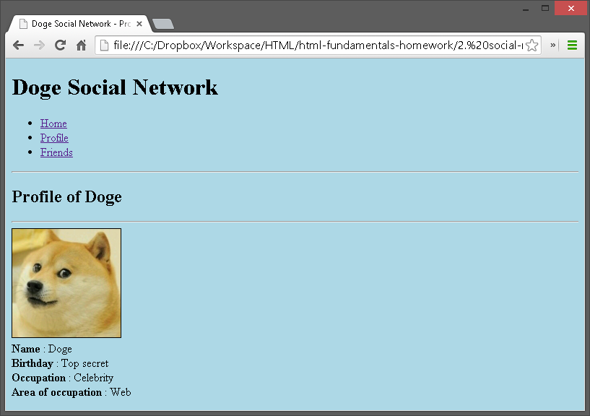

###### [My Telerik Academy Courses](https://github.com/nikolovdeyan/TelerikAcademy) 
-------------------------------------

Problem 3. Social site
=================

*	Create an user profile Web page `profile.html`, friends page named `friends.html` and info page named `home.html`.
*	Link them to one another using `<a>` tag

