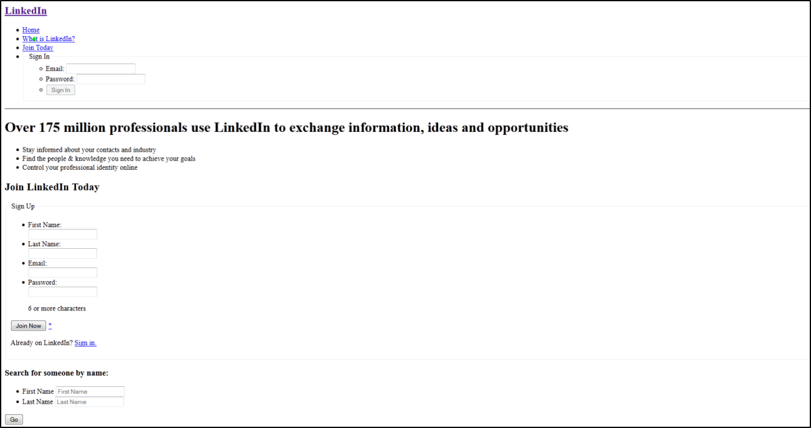

###### [My Telerik Academy Courses](https://github.com/nikolovdeyan/TelerikAcademy) 
-------------------------------------

Problem 3. LinkedIn
=============

*	Create a web page using semantic HTML by the design.

_Note: Do not try to make the same styles. Implement just the content with its semantics._
