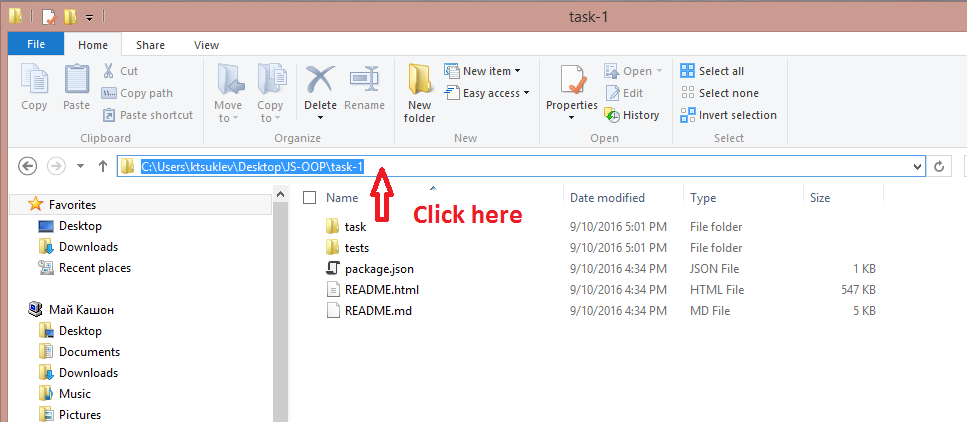
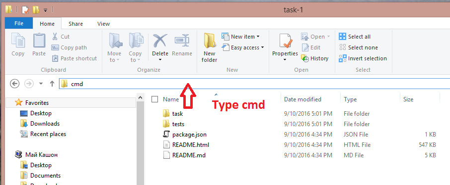
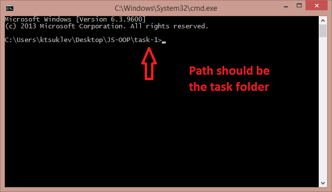
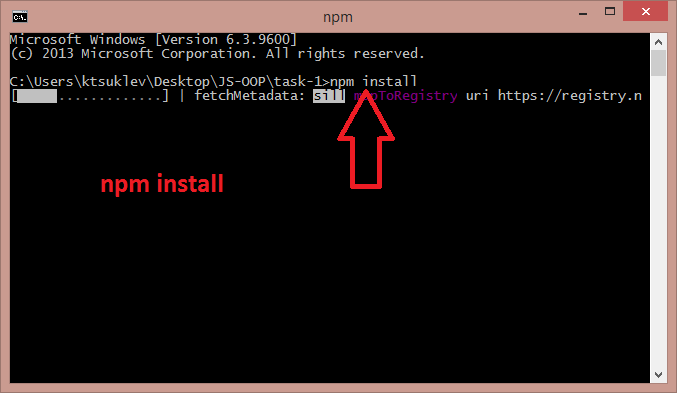
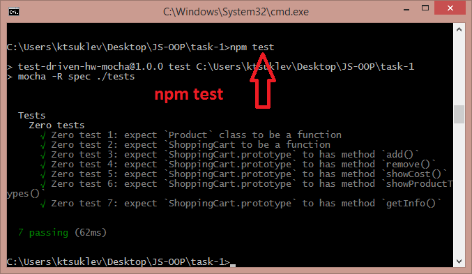
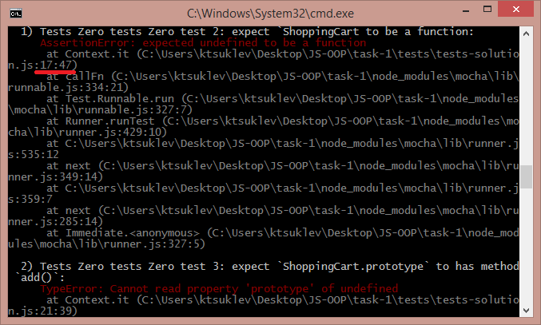

# Running test locally

## Required steps
- [Installing node.js (on Windows)](#node)
- [Install modules](#modules)
- [Test solution](#test)

## Installing node.js (on Windows)
- **If you have node.js you can skip this step**
- Download from node.js from [here](https://nodejs.org/dist/v6.5.0/node-v6.5.0-x86.msi)
  - And install it
    - Next -> Next -> Next -> ...
- Ensure `node` and `npm` are in the ENVIRONMENT PATH
  - If you can run `node -v` in cmd you are OK :)

## Install modules
- Open terminal/shell/command prompt in the folder with the task
  - Example on Windows:

    

    

    
- Run `npm install` and wait

    
  - _You should have internet connection in order to run this step_

## Test solution
- Open terminal/shell/command prompt in the folder with the task
- Run `npm test`
  - You will see something like

    
  - If you have wrong tests you can look at the stack trace

    
